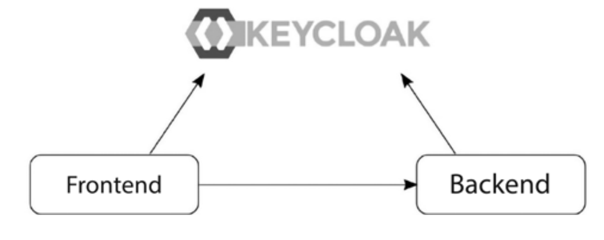
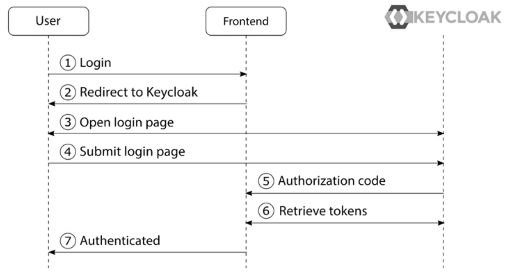
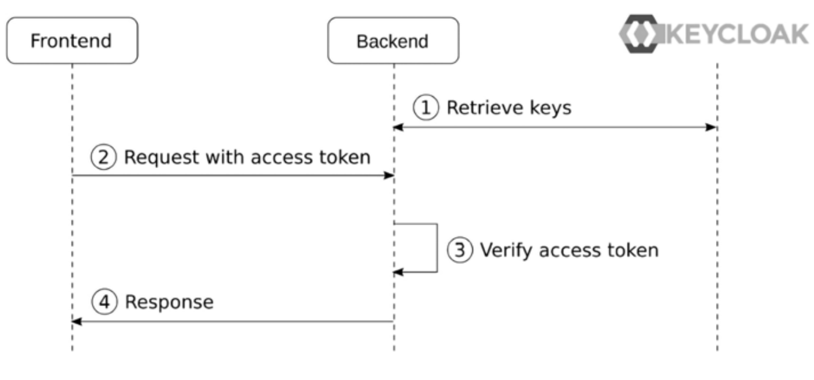

# Understanding the sample application

> Source: Keycloak - Identity and Access Management for Modern Applications_ Harness the power of Keycloak, OpenID Connect, and OAuth 2.0 (2023, Packt Publishing)

In this example, you will learn how to secure your first application with Keycloak. To make things a 
bit more interesting, the sample application you will be running consists of two parts, a frontend 
web application and a backend REST API. This will show you how a user can authenticate to 
the frontend, and also how it is able to securely invoke the backend.

The sample application consists of two parts – a frontend web application and a backend REST API.
The frontend web application is a single-page application written in JavaScript. As we want to
focus on what Keycloak can offer, the application is very simple. Furthermore, to make it as simple
as possible to run the application, it uses Node.js. The application provides the following features:
- Login with Keycloak.
- It displays the user’s name.
- It displays the user’s profile picture, if available.
- It shows the ID token.
- It shows the Access token.
- It refreshes the tokens.
- It invokes the secured endpoint provided by the backend.
  
The backend REST API is also very simple and is implemented with Node.js. It provides a REST API with two endpoints:
- /public: A publicly available endpoint with no security
- /secured: A secured endpoint requiring an access token with the myrealm global role
  
Node.js is used for example applications as we want to make the code as easy to understand and
as simple to run as possible, regardless of what programming language you are familiar with.

The following diagram shows the relationship between the frontend, the backend, and Keycloak.
The frontend authenticates the users using Keycloak and then invokes the backend, which uses
Keycloak to verify that the request should be permitted:


# Workflow
When the user clicks on the login button in the frontend application, the browser is redirected to
the Keycloak login page. The user then authenticates with Keycloak, before the browser is redirected back to the application with a special code called an authorization code. The application then invokes Keycloak to exchange the authorization code for the following tokens:
- An ID token: This provides the application information pertaining to the authenticated user.
- An access token: The application includes this token when making a request to a service,which allows the service to verify whether the request should be permitted.
- A refresh token: Both the ID and the access token have short expirations – by default, 5 minutes. The refresh token is used by the application to obtain new tokens from Keycloak.

The flow described is what is known as the authorization code flow in OpenID Connect

The steps in this diagram are as follows:
1. The User clicks on the login button.
2. The application redirects to the Keycloak Login page.
3. The Keycloak login page is displayed to the User.
4. The User fills in the username and password and submits the results to Keycloak.
5. After verifying the username and password, Keycloak sends the Authorization code to the application.
6. The application exchanges the Authorization code for an ID token and an access token.
The application can now verify the identity of the user by inspecting the ID token.

The next step related to Keycloak is when the frontend invokes the backend. The backend REST
API has a protected endpoint that can only be invoked by a user with the global role, myrole.
To be completely accurate, the frontend is granted permissions to invoke the backend on behalf
of the user. This is part of the beauty of OAuth 2.0. An application does not have access to do
everything that the user is able to do, only what it should be able to do.

To help visualize what happens when the frontend sends a request to the backend, take a look
at the following diagram:

1. The Backend retrieves Keycloak’s public keys. The Backend does not need to do this for
all requests to the Backend, but can instead cache the keys in memory.
2. The Frontend sends a request to the Backend, including the access token.
3. The Backend uses the public keys it retrieved earlier to verify that the access token was
issued by a trusted Keycloak instance, and then verifies that the token is valid and that
the token contains the role myrole.
4. The Backend returns the results to the Frontend.
5. 
# Running the application
## Locally
**KeyCloak**

you should have Keycloak running with the realm created. In summary, what
you require before continuing is the following:
- Keycloak up and running
- A realm named myrealm
- A global role named myrole
- A user with the preceding role

Client:
- Client ID: myclient
- Valid redirect URIs: http://localhost:8000/
- Valid post redirect URIs: http://localhost:8000/
- Web origins: http://localhost:8000

```bash
docker run -d --name keycloak-nodejs-quickstart -p 8080:8080 \
        -e KEYCLOAK_ADMIN=admin -e KEYCLOAK_ADMIN_PASSWORD=admin \
        -v ./docker/keycloak/export:/opt/keycloak/data/import \
        quay.io/keycloak/keycloak:24.0.5 \
        start-dev --import-realm
```
start container
```bash
docker start keycloak-nodejs-quickstart
```
stop container
```bash
docker stop keycloak-nodejs-quickstart
```

# export config

export specific realm
```bash
docker exec -u root -t -i keycloak-nodejs-quickstart /opt/keycloak/bin/kc.sh export --file /tmp/myrealm-realm.json --users realm_file --realm myrealm

docker cp keycloak-nodejs-quickstart:/tmp/myrealm-realm.json docker/keycloak/
```
**Backend**

cd backend
npm install
npm start

**Frontend**

cd frontend
npm install
npm start

## Docker

# acces app
**KeyCloak**

http://localhost:8080/

**Backend**
http://localhost:3000/

**Frontend**
http://localhost:8000/

username:keycloak

password:keycloak